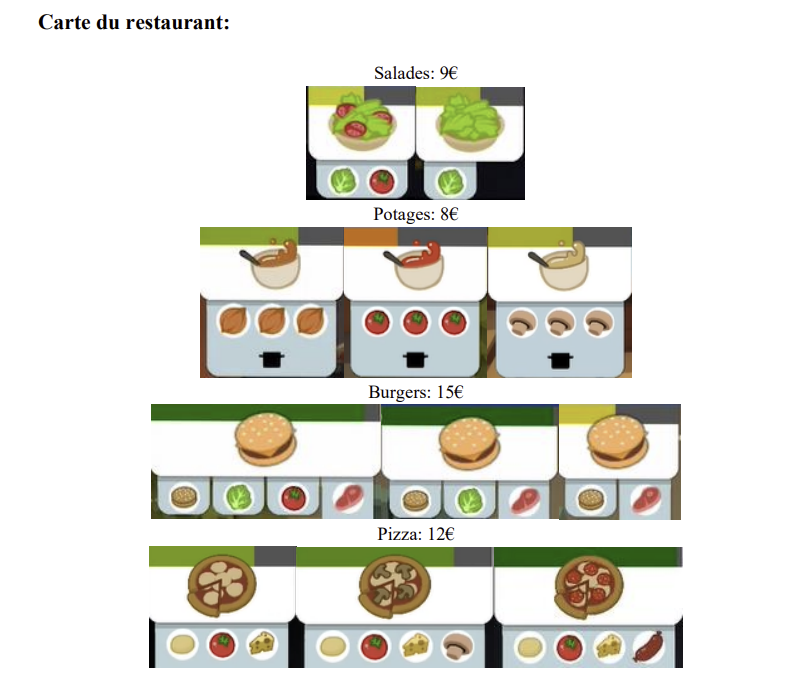

# Restaurant Management Project Documentation

Welcome to the documentation of the Java restaurant management project. This project aims to provide a robust backend application for the daily management of a restaurant, including order taking, employee management, inventory tracking, and much more. This documentation is designed to help you set up, run, and understand the functioning of the application.

## Environment Configuration

### Prerequisites
- Java Development Kit (JDK) version 8 or higher.
- An Integrated Development Environment (IDE) such as Eclipse, IntelliJ IDEA, or any other IDE that supports Java development.
- Basic knowledge of Java and object-oriented programming.

### Installation and Configuration

#### Java Development Kit (JDK) 

##### Installation:
1. Download and install the JDK from the official Oracle website or adopt OpenJDK.
2. Configure the JAVA_HOME environment variable to point to the JDK installation directory.
3. Make sure the path to the Java executable is included in your PATH environment variable.

#### IDE Configuration:
1. Download and install your preferred IDE.
2. Import the project into your IDE:
    - For Eclipse: File > Import > Existing Projects into Workspace.
    - For IntelliJ IDEA: File > Open > Select the project folder.

#### Project Structure:
The project is structured into multiple packages, each having a specific responsibility (e.g., employee management, inventory management, order taking).

## Running the Application
To launch the application, navigate to the `App.java` class in your IDE and run it as a standard Java application. This will start the application in your IDE's console.

## Main Menu
When the application starts, you will see a main menu with the following options:

1. Order Taking Screen
2. Kitchen Screen
3. Bar Screen
4. Monitoring Screen
5. Employee Management
6. Inventory Management
7. Employee Scheduling for the Evening
8. Bill Management
9. Invoice Display Screen
0. Quit

Select the desired option by entering the corresponding number in the console.

## Key Features
- Order Taking: Allows taking orders from customers, including dishes and drinks. Table assignment to customers by servers.
- Kitchen and Bar Management: Orders are automatically sent to the kitchen and bar for preparation. Cooks and bartenders can view orders to be prepared and mark orders as completed.
- Employee Management: Addition, deletion, and display of employees. Management of contracts and work schedules.
- Inventory Management: Tracking and updating of ingredient, dish, and drink stocks. Display of current stock status.
- Monitoring and Reporting: The manager can monitor restaurant performance, including sales and stocks. Generation of shopping lists based on stocks and sales.

## Closing the Application
To exit the application, select option 0 - Quit from the main menu. Before exiting, the application will perform necessary cleanup, such as saving the current project state.

## Conclusion
This restaurant management application is a comprehensive tool designed to facilitate the daily management of a restaurant. By following this documentation, you should be able to set up, run, and use the application to efficiently manage various tasks related to running a restaurant.

For any further questions or assistance, feel free to consult your IDE's documentation or online resources for Java development.
